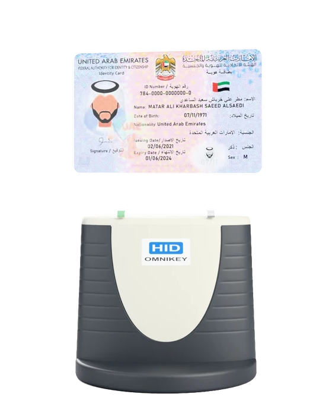

<p align="center">
  
</p>

<h1 align="center">Emirates ID Reader SDK</h1>

<p align="center">
  A Rust SDK for Emirates ID contact chips<br>
  <strong>v0.1.0 · Experimental</strong>
</p>

<p align="center">
  <a href="https://github.com/k3beidli/emirates-id-reader/wiki">Documentation</a> ·
  <a href="https://github.com/k3beidli/emirates-id-reader/wiki/Getting-Started">Quick start</a> ·
  <a href="https://github.com/k3beidli/emirates-id-reader/wiki/API-Reference">API reference</a>
</p>

Read publicly accessible data from Emirates ID contact chips through a compatible
PC/SC reader. Get names, photographs, identifiers, dates, and extended fields
from one in-memory snapshot, with optional helpers for display formatting.

## Status and scope

Hardware testing has been limited to the **HID OMNIKEY 3121 on Windows**.
Other PC/SC readers may work, but **no other reader models have been tested**.

| Platform | Support status |
| --- | --- |
| Windows | Tested with the HID OMNIKEY 3121 only |
| Linux | Expected to work through pcsc-lite; no hardware testing performed |
| macOS | Expected to work through the system PCSC framework; no hardware testing performed |

V1 and V2 use the same data model. Field availability depends on the card and
read options. See [card compatibility](https://github.com/k3beidli/emirates-id-reader/wiki/Card-Generations)
and [testing details](https://github.com/k3beidli/emirates-id-reader/wiki/Testing)
for the historical results and current validation limits. Automated build and
synthetic tests do not establish reader compatibility.

**Fingerprint scanning has not been implemented yet.** Reading fingerprint
templates from the chip is also not implemented.

Reads are local: the library makes no network requests and does not save card data.
It does not bypass protected files.

## Installation

Requires **Rust 1.85+** and your platform's PC/SC prerequisites. Follow the
[installation guide](https://github.com/k3beidli/emirates-id-reader/wiki/Platforms),
then add the SDK directly from GitHub:

```toml
[dependencies]
emirates-id-reader = { git = "https://github.com/k3beidli/emirates-id-reader" }
```

Keep your application's `Cargo.lock` under version control to retain the resolved
Git revision.

<a id="reading-and-accessing-data"></a>
<a id="stored-values-and-formatted-values"></a>

## Example

```rust,no_run
use emirates_id_reader::{CardSession, ReadOptions};

fn main() -> Result<(), emirates_id_reader::Error> {
    let session = CardSession::connect_first()?;
    let options = ReadOptions::identity_only().with_photo(true);
    let card = session.read_with_options(options)?;

    let name = card.get_formatted_name();
    let id = card.formatted_id_number();
    let photo = card.get_photo();

    // Pass these values to your UI; getters make no additional chip reads.
    let _ = (name, id, photo);

    Ok(())
}
```

Original decoded values remain available through `get_name()`, `get_id_number()`,
and the public fields. See [names and formatting](https://github.com/k3beidli/emirates-id-reader/wiki/Names)
for Arabic/English selection and comma separators.

<a id="examples-and-diagnostic-cli"></a>

## Documentation

The **[GitHub Wiki](https://github.com/k3beidli/emirates-id-reader/wiki)** contains the guides,
examples, field definitions, and technical explanations.

| Start here | Learn more |
| --- | --- |
| [Your first read](https://github.com/k3beidli/emirates-id-reader/wiki/Getting-Started) | Connect, read, and access data |
| [Working with data](https://github.com/k3beidli/emirates-id-reader/wiki/Data-Model) | Names, codes, dates, images, and missing values |
| [API reference](https://github.com/k3beidli/emirates-id-reader/wiki/API-Reference) | Getters, types, and reading options |
| [Troubleshooting](https://github.com/k3beidli/emirates-id-reader/wiki/Troubleshooting) | Reader setup and common errors |
| [How it works](https://github.com/k3beidli/emirates-id-reader/wiki/Architecture) | Card communication and decoding |

Guides are also available in [docs/](docs/wiki-home.md). For local Rust API
documentation, run:

```sh
cargo doc --no-deps --open
```

<a id="development"></a>

<a id="credits"></a>
<a id="license"></a>

## Credits and license

Based on the ICP V1/V2 field references and EIDA Toolkit documentation, with
[pcsc-rust](https://github.com/bluetech/pcsc-rust) for reader access and
[Serde](https://serde.rs/) for serialization. Full credits are in
[sources and acknowledgments](https://github.com/k3beidli/emirates-id-reader/wiki/Sources).

This project is unofficial and is not affiliated with or endorsed by ICP.
See [security and access boundaries](https://github.com/k3beidli/emirates-id-reader/wiki/Security)
for guidance on handling cardholder data.

[MIT license](LICENSE) · [Contributing](CONTRIBUTING.md)
